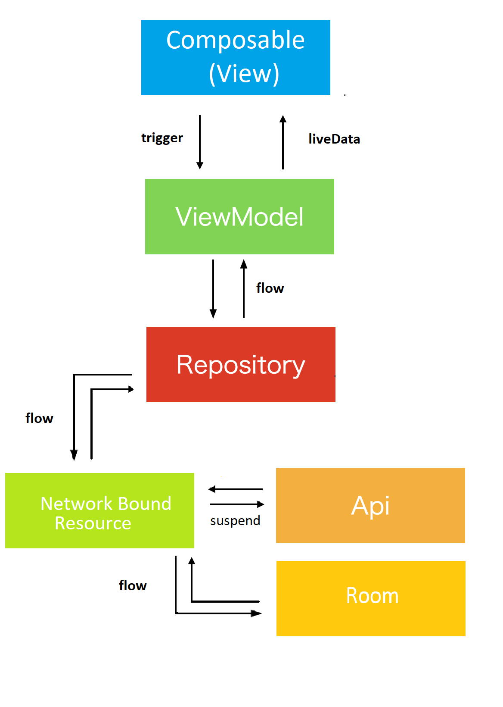

# Github RepoSearch
### Using Compose And Flow
A sample Github RepoSearch app using Android Compose as it's UI, Kotlin Flow as its data asynchronous flow and observe in Compose UIs as LiveData, Dagger Hilt as it's dependency injection, Room for offline cache and MVVM architect.
#### Key Features
****
The app cover the following features:
* Offline Cache
* Swipe to Refresh
* Error Handling
* Network check

## Apk link
Download RepoSearch app at [Google Drive ](https://drive.google.com/file/d/1VR5n7oMENmtyWMwccxCnP-k0XFnptZVI/view?usp=sharing).

## Screenshot
Watch screen flow in RepoSearch app at [youtube ](https://youtu.be/uoAo-_XJvdI).
repo search list|keyword suggestion list|repo detail
:--:|:--:|:--:
||

## Architecture


## Observe Flow as LiveData usage in HomePage repo list suggestion
Call a ViewModel function, and call to [Kotlin Flow](https://kotlin.github.io/kotlinx.coroutines/kotlinx-coroutines-core/kotlinx.coroutines.flow/-mutable-shared-flow/).
After transformed to LiveData with [ViewModelScope](https://developer.android.com/topic/libraries/architecture/coroutines#viewmodelscope),
observe safely it with observeAsState in Composable View using [Android LiveData](https://developer.android.com/reference/kotlin/androidx/compose/runtime/livedata/package-summary).

```kotlin
@HiltViewModel
class RepoListPageViewModel @Inject constructor(

  savedStateHandle: SavedStateHandle,
  private val repository: RepoSearchBaseRepository,
  networkStatusDetector: NetworkStatusDetector,
  private val preferenceProvider: PreferenceProvider,
  private val application: Application

) :
  ViewModel() {

  private val tag: String = "RepoListPageViewModel"
  private val repoName: String = savedStateHandle.get<String>("repo_name").orEmpty()
  val searchText = MutableLiveData(repoName)
  private val repoList = MutableLiveData<Resource<List<Repo>>>()
  val repos: LiveData<Resource<List<Repo>>> get() = repoList

  @OptIn(FlowPreview::class)
  val networkState =
    networkStatusDetector.networkStatus
      .map (
        onAvailable = { NetworkConnectionState.Fetched },
        onUnavailable = { NetworkConnectionState.Error },
      )

  val isRefreshing = MutableLiveData<Boolean>()
  val showSearchTextEmptyToast = MutableLiveData<Boolean>()
  val isConnected = MutableLiveData<Boolean>()

  init {

    Log.e(tag, "init")
    Log.e(tag, "Argument: $repoName")
    Log.e(tag, "SearchText: ${searchText.value}")

    submit()

  }


  @OptIn(FlowPreview::class)
  fun submit() {
    Log.e(tag, "fetch RepoList")

    viewModelScope.launch {
      Log.e(tag, "in ViewModelScope")
      Log.e(tag, "preferenceKeyword: ${preferenceProvider.getSearchKeyword()}")
      if(searchText.value?.isEmpty() == true){
        showSearchTextEmptyToast.value = true
      }else {
        showSearchTextEmptyToast.value = false
        if (preferenceProvider.getSearchKeyword() == searchText.value) {
          Log.e(tag, "Not Need connection")
          repository.getRepoListNetworkBoundResource(searchText.value!!).collect {
            repoList.value = it
          }
        } else {
          if (CurrentNetworkStatus.getNetwork(application.applicationContext)) {
            repository.getRepoListNetworkBoundResource(searchText.value!!).collect {
              repoList.value = it
            }
          } else {
            Log.e(tag, "Need connection")
          }
        }
      }

      networkState.collect{
        isConnected.value = when (it) {
          NetworkConnectionState.Fetched  -> {
            Log.e(tag, "Network Status: Fetched")
            true
          }
          else -> {
            Log.e(tag, "Network Status: Error")
            false
          }
        }
      }

    }

  }

}

```

```kotlin
@OptIn(ExperimentalComposeUiApi::class)
@Composable
fun RepoListPage(
  navHostController: NavHostController,
  repoListPageViewModel: RepoListPageViewModel,
) {
  val searchText: String by repoListPageViewModel.searchText.observeAsState("")
  val repoListNBR by repoListPageViewModel.repos.observeAsState(Resource.Start)
  val isConnected by repoListPageViewModel.isConnected.observeAsState(false)
  val isRefreshing by repoListPageViewModel.isRefreshing.observeAsState(false)
  val isShowSearchTextEmptyToast by repoListPageViewModel.showSearchTextEmptyToast.observeAsState(false)

  val isLoading: Boolean
  var errorMessage = ""
  var repoList: List<Repo> = listOf()
  val context = LocalContext.current
  val keyboardController = LocalSoftwareKeyboardController.current
  val needConnectionMessage = stringResource(id = R.string.need_connection_message)
  val keywordEmptyMessage = stringResource(id = R.string.keyword_empty)


  if(isShowSearchTextEmptyToast){
    Toast.makeText(
      context,
      keywordEmptyMessage,
      Toast.LENGTH_SHORT
    ).show()
    repoListPageViewModel.showSearchTextEmptyToastCollected()
  }

  when (repoListNBR) {
    Resource.Loading -> {
      Log.e(TAG, "RepoSearch Fetch Loading")
      isLoading = repoListNBR.isLoading
    }
    Resource.Fail("") -> {
      Log.e(TAG, "RepoSearch Fetch Fail")
      isLoading = false
      errorMessage = repoListNBR.errorMessage.orEmpty()
    }
    else -> {
      Log.e(TAG, "RepoSearch Fetch Success")
      isLoading = false
      repoList = repoListNBR.data.orEmpty()
      repoListPageViewModel.onDoneCollectResource()
    }
  }

  Scaffold(topBar = {
    AppBarWithSearchBox(
      searchText,
      stringResource(id = R.string.search_repo),
      onSearchBarClick = {
        navHostController.navigate(
          route = NavPath.KeywordSearchPage.route,
        )
      },
      onSearchTextChanged = { repoListPageViewModel.onSearchTextChanged(it) },
      onClearClick = { repoListPageViewModel.onSearchBoxClear() },
      onKeyboardSearchTextChanged = {
        keyboardController?.hide()
        repoListPageViewModel.onKeyboardSearchClick(searchText)
      }
    )
  }) {
      paddingValues ->
    Column(
      verticalArrangement = Arrangement.spacedBy(10.dp),
      horizontalAlignment = Alignment.CenterHorizontally
    ) {

      NetworkAlertScreen(
        connectionMessage = when (isConnected) {
          true -> {
            stringResource(
              id = R.string.connected
            )
          }
          else -> {
            stringResource(
              id = R.string.not_connected
            )
          }
        }
      )
      RepoListView(
        showProgress = isLoading,
        apiErrorMessage = errorMessage,
        onRetryClick = {
          repoListPageViewModel.retry()
        },
        modifier = Modifier.padding(paddingValues),
        isDataNotEmpty = repoList.isNotEmpty(),
        isConnected = isConnected

      ) {

        SwipeRefresh(
          state = rememberSwipeRefreshState(isRefreshing),
          onRefresh = {
            if(isConnected) {
              repoListPageViewModel.refresh()
            }else{
              Toast.makeText(
                context,
                needConnectionMessage,
                Toast.LENGTH_SHORT
              ).show()
            }
          }
        ) {
          LazyColumn(
            modifier = Modifier.fillMaxWidth(),
            contentPadding = PaddingValues(5.dp)
          ) {

            items(items = repoList) { repo ->
              RepoRow(repo = repo) {
                val argRepo = repo.toJson()
                Log.e(TAG, "repo: $argRepo")
                argRepo?.let {
                  navHostController.navigate(
                    route =
                    "${NavPath.RepoDetailPage.route}?repo=${argRepo}"
                  )
                }

              }
            }
          }


        }


      }


    }

  }


}

```

## Observe Flow as LiveData usage in KeywordSearchPage keyword list
Call a ViewModel function, and call to [kotlin flow](https://kotlinlang.org/docs/flow.html).

After transformed to LiveData with [ViewModelScope](https://developer.android.com/topic/libraries/architecture/coroutines#viewmodelscope),
observe safely it with observeAsState in Composable View.

```kotlin
@HiltViewModel
class KeywordSearchPageViewModel @Inject constructor(
  private val appRepository: KeywordSearchBaseRepository,
  savedStateHandle: SavedStateHandle,
) : ViewModel() {

  private val tag: String = "KeywordPageViewModel"
  private val repoName: String = savedStateHandle.get<String>("repo").orEmpty()

  val searchText = MutableLiveData(repoName)

  private val keywordList = MutableLiveData<Resource<List<Keyword>>>()
  val keywords: LiveData<Resource<List<Keyword>>> get() = keywordList


  init {

    Log.e(tag, "init")
    Log.e(tag, "Argument: $repoName")
    Log.e(tag, "SearchText: ${searchText.value}")

    submit()

  }


  private fun submit() {
    Log.e(tag, "fetchAllKeywordList()")

    viewModelScope.launch {
      Log.e(tag, "in ViewModelScope")
      appRepository.getKeywordListNetworkBoundResource(searchText.value!!).collect {
        keywordList.value = it
      }
    }

  }
}


```
```kotlin

@ExperimentalComposeUiApi
@ExperimentalAnimationApi
@Composable
fun KeywordSearchPage(navHostController: NavHostController, keywordSearchPageViewModel: KeywordSearchPageViewModel) {

  val searchText by keywordSearchPageViewModel.searchText.observeAsState(initial = "")
  val keywordListNBR by keywordSearchPageViewModel.keywords.observeAsState(Resource.Start)

  var isLoading = false
  var errorMessage = ""
  var keywordList: List<Keyword> = listOf()


  when (keywordListNBR) {
    Resource.Loading -> {
      Log.e(TAG, "keywordListNBR Loading")
      isLoading = keywordListNBR.isLoading
    }
    Resource.Fail("") -> {
      Log.e(TAG, "keywordListNBR  Fail")
      errorMessage = keywordListNBR.errorMessage.orEmpty()
    }
    else -> {
      Log.e(TAG, "keywordListNBR Success")
      keywordList = keywordListNBR.data.orEmpty()
      when(keywordListNBR.data.isNullOrEmpty()){
        true -> Log.e(TAG, "keyword list : NullOrEmpty")
        else -> {
          Log.e(TAG, "first keyword : ${keywordList.first().name}")
        }

      }

    }
  }

  Log.e(TAG, "searchText: $searchText")

  KeywordSearchBoxView(
    searchText = searchText,
    placeholderText = stringResource(R.string.search_keyword),
    onSearchTextChanged = { keywordSearchPageViewModel.onSearchTextChanged(it) },
    onClearClick = { keywordSearchPageViewModel.onSearchBoxClear() },
    onNavigateBack = {
      Log.e(TAG, "onNavigateBack")
      navHostController.popBackStack()
    },
    showProgress = isLoading,
    errorMessage = errorMessage,
    matchesFound = keywordList.isNotEmpty(),
    onRetryClick = {
      keywordSearchPageViewModel.retry()
    },
    onKeywordClick = {
      navHostController.navigate(
        route = "${NavPath.RepoListPage.route}?repoName=$searchText"
      )
    }
  ) {
    LazyColumn(
      modifier = Modifier.fillMaxWidth(),
      contentPadding = PaddingValues(5.dp)
    ) {

      items(items = keywordList) { keyword ->
        KeywordRow(keyword = keyword) {
          val argRepoName = keyword.name
          Log.e(TAG, "Route: ${NavPath.RepoListPage.route}?repoName=$argRepoName")
          navHostController.navigate(
            route = "${NavPath.RepoListPage.route}?repoName=${argRepoName}"
          )
        }
      }
    }
  }


}
```

## Using Room and Network Bound Resource for offline cache 
Use Room database for offline storage and cache [Room](https://developer.android.com/training/data-storage/room/accessing-data) 

### RepoSearchDatabase
```kotlin
@Database(entities = [Repo::class, Owner::class, Keyword::class], version = 1, exportSchema = false)
abstract class RepoSearchDatabase() : RoomDatabase() {

  abstract fun repoDao(): RepoDao

  abstract fun ownerDao(): OwnerDao

  abstract fun repoDetailDao() : RepoDetailDao

  abstract fun keywordDao(): KeywordDao


}

```
### RepoDetail Table Dao
```kotlin

@Dao
abstract class RepoDetailDao: RepoDao, OwnerDao {

  fun insertToRepoDetail(repos: List<Repo>) {
    // delete previous data
    deleteAllRepos()
    deleteAllOwners()

    // save new data
    for (r in repos) {
      r.owner.repoId = r.id
      upsertOwner(r.owner)
    }
    insertReposToRepoDetail(repos)
  }

  fun getRepoDetail() : Flow<List<Repo>> {
    val repoDetail = _getAllFromRepoDetail()
    val repos: MutableList<Repo> = mutableListOf()
    for (i in repoDetail) {
      i.repo.owner = i.owner
      repos.add(i.repo)
    }
    Log.e("RepoDetailDao", "getRepos from RepoDetail: size ${repos.size}")
    return flow { emit(repos) }
  }

  fun getRepoDetailById(repoId: Long) : Flow<Repo> {
    val repoWithOwner = _getRepoDetailById(repoId)
    val repo = repoWithOwner.repo
    repo.owner = repoWithOwner.owner
    return flow { emit(repo) }
  }

  // insert or update if exists
  @Insert(onConflict = OnConflictStrategy.REPLACE)
  abstract fun upsertRepos(repos: List<Repo>)

  @Insert(onConflict = OnConflictStrategy.IGNORE)
  abstract fun insertReposToRepoDetail(repos: List<Repo>)

  @Transaction
  @Query("SELECT * FROM Repo, Owner WHERE Repo.id = Owner.repoId ORDER BY Repo.stargazersCount DESC")
  abstract fun _getAllFromRepoDetail() : List<RepoDetail>

  @Transaction
  @Query("SELECT * FROM Repo INNER JOIN Owner ON Owner.repoId = Repo.id WHERE Repo.id = :repoId")
  abstract fun _getRepoDetailById(repoId: Long) : RepoDetail

}

```
### Repo Table Dao
```kotlin
@Dao
interface RepoDao {

  @Insert(onConflict = OnConflictStrategy.REPLACE)
  suspend fun insertAll(repos: List<Repo>)

  @Query("DELETE FROM Repo")
  suspend fun deleteAll()

  @Query("SELECT * FROM Repo WHERE name IN (:repoNames)")
  fun getRepos(repoNames: String): Flow<List<Repo>>

  @Query("SELECT * FROM Repo WHERE name LIKE '%' || (:repoName) || '%'")
  fun getFilteredRepos(repoName: String?): Flow<List<Repo>>

  @Query("DELETE FROM Repo")
  abstract fun deleteAllRepos()


  @Insert(onConflict = OnConflictStrategy.REPLACE)
  abstract fun upsertRepo(vararg repo: Repo)
}


```
### Owner Table Dao
```kotlin
@Dao
interface OwnerDao {

  @Insert(onConflict = OnConflictStrategy.REPLACE)
  abstract fun upsertOwner(owner: Owner)

  @Query("DELETE FROM Owner")
  abstract fun deleteAllOwners()

}

```
### RepoSearch Repository with Network Bound Resource for offline cache
###Network Bound Resource  [Network Bound Resource](https://developer.android.com/topic/libraries/architecture/coroutines#viewmodelscope).
```kotlin
class RepoSearchRepository @Inject constructor(
  private val apiDataSource: RestDataSource,
  private val dbDataSource: RepoSearchDatabase,
  private val prefs: PreferenceProvider,
  private val appContext: Context
): RepoSearchBaseRepository {

  private val repoDetailDao = dbDataSource.repoDetailDao()

  override fun getRepoListNetworkBoundResource(s: String): Flow<Resource<List<Repo>>> {

    return repoSearchNetworkBoundResource(

      // make request
      fetchRemote = {
        Log.e("Repository", "fetchRemote()")
        apiDataSource.searchRepos(s, 50)
      },

      // extract data
      getDataFromResponse = {
        Log.e("Repository", "getDataFromResponse()")
        it.body()!!.items
      },

      // save data
      saveFetchResult = {
          repos ->
        Log.e("Repository", "saveFetchResult()")
        prefs.setSearchKeyword(s)
        repoDetailDao.insertToRepoDetail(repos)

      },

      // return saved data
      fetchLocal = {
        Log.e("Repository", "fetchLocal()")
        repoDetailDao.getRepoDetail()
      },

      // should fetch data from remote api or local db
      shouldFetch = {
        Log.e("Repository", "shouldFetch()")
        CurrentNetworkStatus.getNetwork(appContext)
      }


    ).flowOn(Dispatchers.IO)
  }


}

```


## Libraries
* [kotlin](https://kotlinlang.org/)
    * [kotlin coroutines](https://github.com/Kotlin/kotlinx.coroutines)
* [material-components](https://github.com/material-components/material-components-android)
* [coil](https://github.com/coil-kt/coil)
* [retrofit](https://github.com/square/retrofit)
* [okhttp](https://github.com/square/okhttp)
* [hilt](https://dagger.dev/hilt/)

### Reference Articles
  * [kotlin flow](https://kotlinlang.org/docs/flow.html)
  * [Android LiveData](https://developer.android.com/reference/kotlin/androidx/compose/runtime/livedata/package-summary)
  * [network_bound_resource](https://medium.com/androiddevelopers/a-safer-way-to-collect-flows-from-android-uis-23080b1f8bda)
  
#### Serve me a coffee and my ethereum wallet is
  * 0x1e68b09f0A3158a73041a871FeC5037586128873